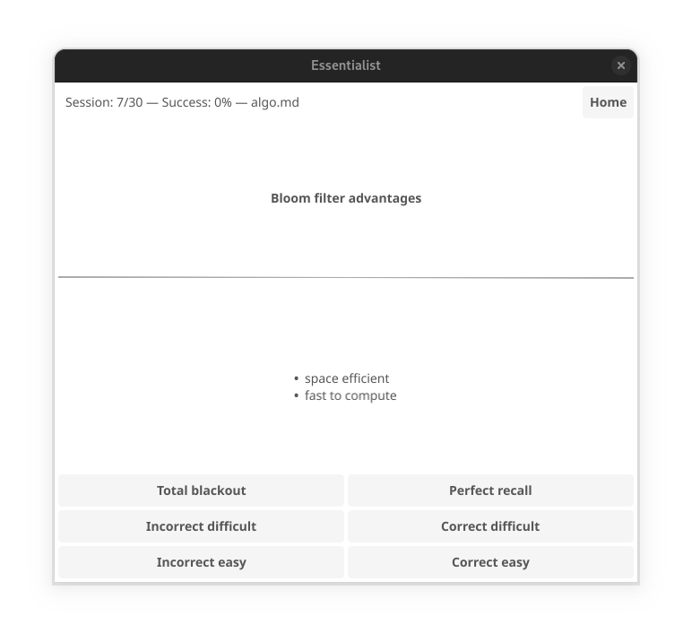

+++
title = 'Essentialist'
date = 2024-09-21T23:33:46+01:00
+++

# Essentialist

Essentialist is an open-source programs for [spaced repetition][1] (similar to
[Anki](https://apps.ankiweb.net/)). Essentialist is **cross-platform** and runs
on Linux, MacOS, Windows and android (download latest version
[here](https://github.com/essentialist-app/essentialist/releases/latest)).

Flash cards are written using the [Markdown][2] format (refer to the [flash
card syntax](#flash-card-syntax)). Writing cards in Markdown is fun and easy.

The space repetition algorithm used is based
on [SM-2][3].

Essentialist respects your **privacy**: your data never leave your device (no
cloud).

[1]: https://en.wikipedia.org/wiki/Spaced_repetition
[2]: https://en.wikipedia.org/wiki/Markdown
[3]: https://en.wikipedia.org/wiki/SuperMemo#Description_of_SM-2_algorithm



See the [CONTRIBUTING.md](/.github/CONTRIBUTING.md) for how to report bugs and
submit pull request.

## Flash card syntax

Each deck of cards is a plain text Markdown files with the extension `.md` (ex:
`sample.md`). You can put all your decks in the same directory.

Each card starts with a heading level 2 (line starting with `##`) defining the
question. The answer is the content following (until the next heading level 2).

You progress is stored in a hidden file `.<deck file>.db` (ex: `.sample.md.db`).

Example of a deck with 3 cards:

```markdown
## Question: what format is used?

Questions and answers are in **Markdown**.

## Are lists supported?

Yes, here is an example:

- one
- **two**
- three

## How to include a table in the answer?

Answer with a table.

|  A  |  B  |
| --- | --- |
| 124 | 456 |
```
